# Ценность пользователей поиска

**E-CUP 2026, задача 3.** По активности 250 000 пользователей Поиска и Каталога
за 01.01.2025-13.02.2026 предсказать суммарный GMV каждого за 14.02.2026-15.03.2026.
Метрика RMSLE.

[Воспроиводимость решения](#как-воспроизвести) · [Итоговое решение с формулами](docs/solution.md) · [Все проверенные идеи](docs/experiments.md) · [Презентация в PDF](slides.pdf)

---

# Решение

По сути это обычный ансамбль моделей и необычный способ подбирать поправки к нему.
Ансамбль из состоит 13 моделей: GRU, читающая историю пользователя как последовательность недель, и градиентный бустинг на агрегатах даёт 1.6462, что даёт 9-е место на паблике.
Дальше идёт второй слой: коэффициенты поправок вычисляются из скоров лидерборда
по формуле вершины параболы. Так 1.6462 превращается в 1.6444.

### 1. Ценность пользователей поиска


### 2. Постановка задачи

Формально это задача регрессия для сумм покупок, но по сути нам нужно моделировать поведение пользователей, то есть понять, вернётся ли
пользователь на платформу и на какую сумму совершит покупки, но об этом позже.

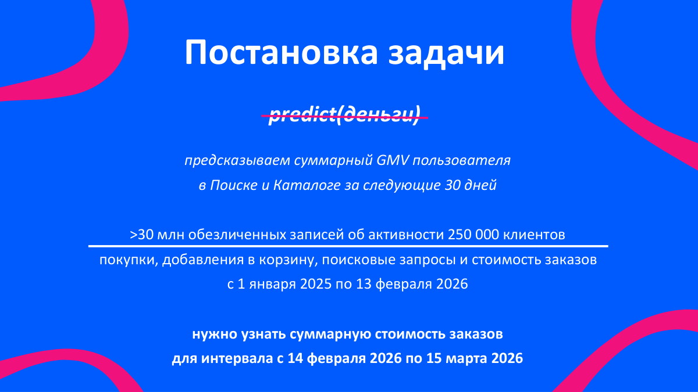

### 3. EDA

Мы проанализировали данные и сделали следующие наблюдения:
- почти половина пользователей не покупает ничего за любые 30 дней
- среди покупающих разброс в стоимости покупок почти в тысячу раз
- выборка отобрана по недавней активности
- у активности пользователей есть недельный ритм

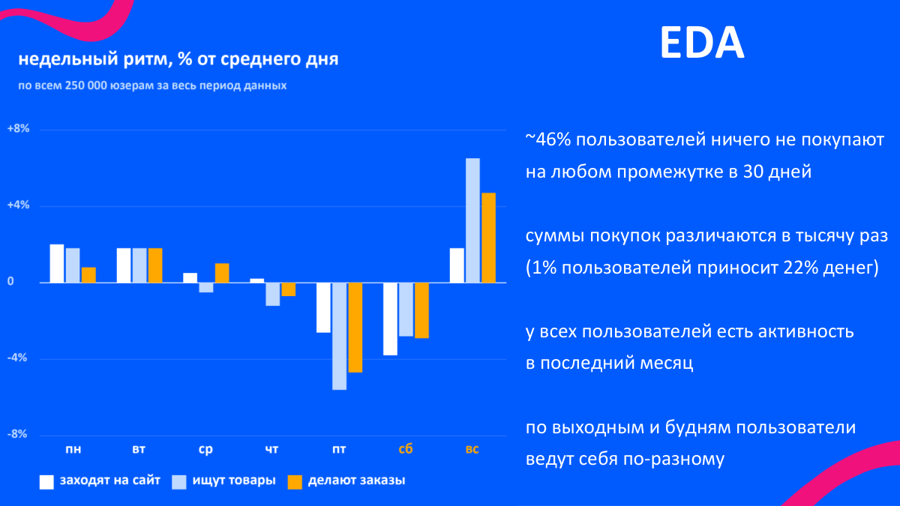

### 4. Что это даёт

Эти наблюдения легли в основу нашего решения следующим образом.

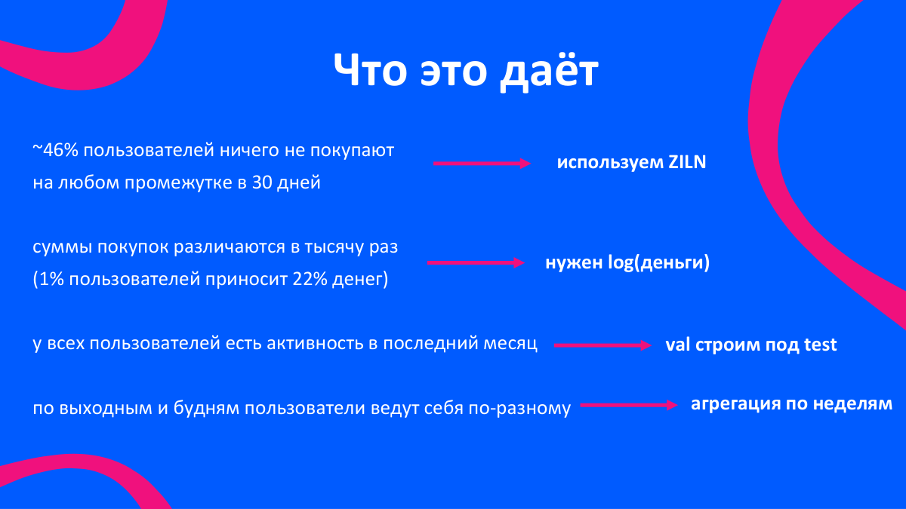

### 5. Делим данные на объекты выборки

Из сплошной истории каждого пользователя получается около 40 обучающих примеров: берём срез,
историю до него считаем признаками, следующие 30 дней ответом. Получаем порядка 10 млн объектов обучающей выборки.

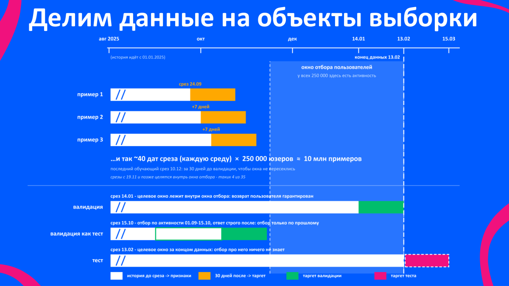

### 6. Feature engineering

Работали с 272 агрегатными признаками на каждого пользователя (активность и заказы в семи временных промежутках от недели до года, давности последних событий, тренды, ритм покупок, воронка, чек, сезонность).

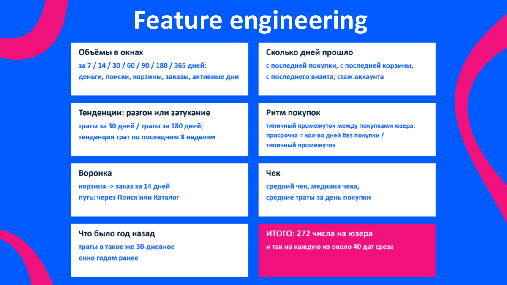

### 7. Потолок классического ML

Четыре независимых движка бустинга упираются в одно и то же значение RMSLE около 1.670. Значит, дело не в алгоритме, просто агрегаты не видят порядок событий внутри отрезка времени, и эту проблему мы решили с помощью обучения GRU.

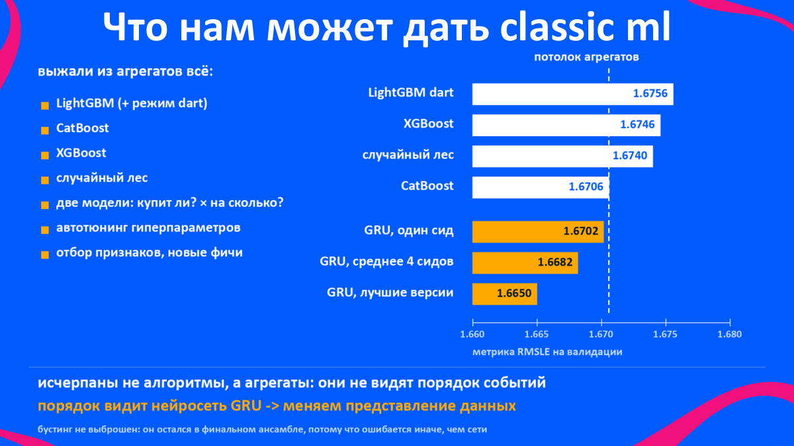

### 8. Основная модель

GRU читает историю как последовательность из 52 шагов (38 недель и последние 14 дней)
и отдаёт три числа: вероятность покупки, типичный чек (логарифмированный) и разброс (степень непредсказуемости пользователя).

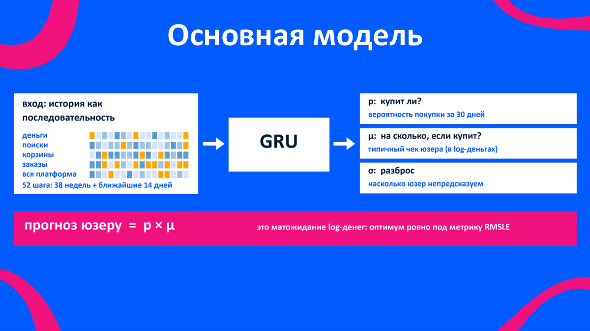

### 9. Зачем модели три числа

Что делает σ внутри функции потерь и зачем нужны вспомогательные головы.

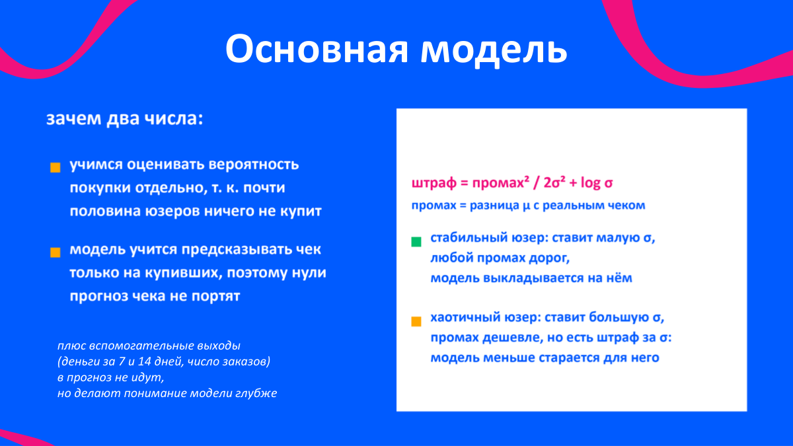

### 10. Ансамбль

Жадный отбор Каруаны на валидации. Это основа решения, дающая 9-е место на паблике (т.е. на 20% данных).

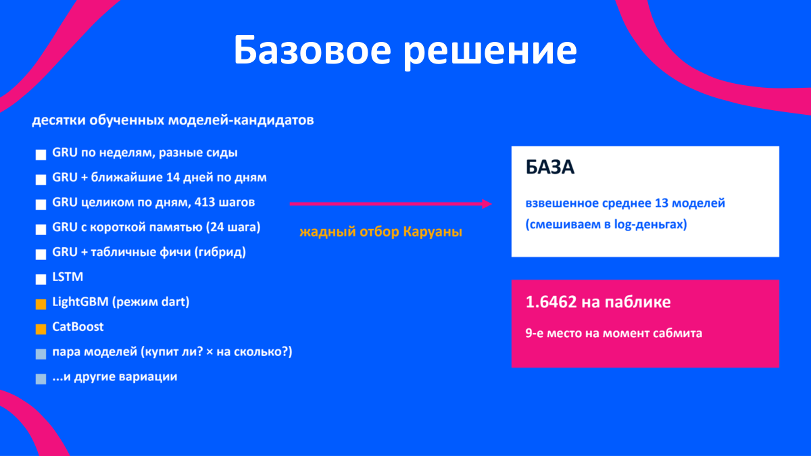

### 11. Олимпиадный приёмчик

Скор сабмита с добавленной поправкой зависит от её веса как парабола,
а вершину можно вычислить, зная скор всего в двух точках. Отправляем сабмит и идеальный
вес поправки становится известен.

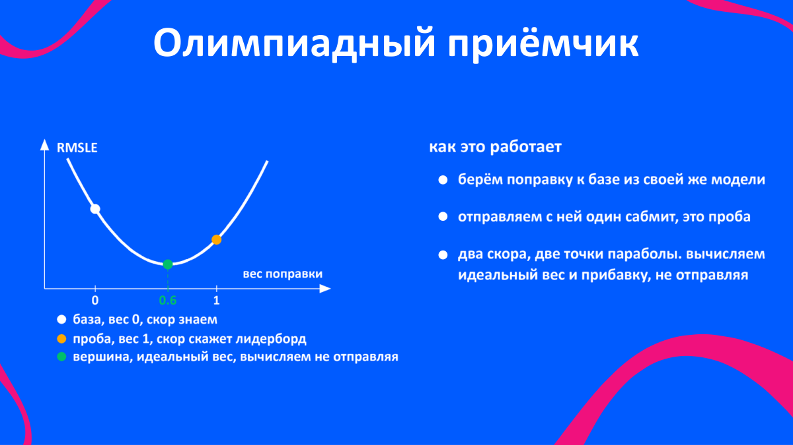

### 12. Как это работает

Вывод формулы для идеального коэффициента.

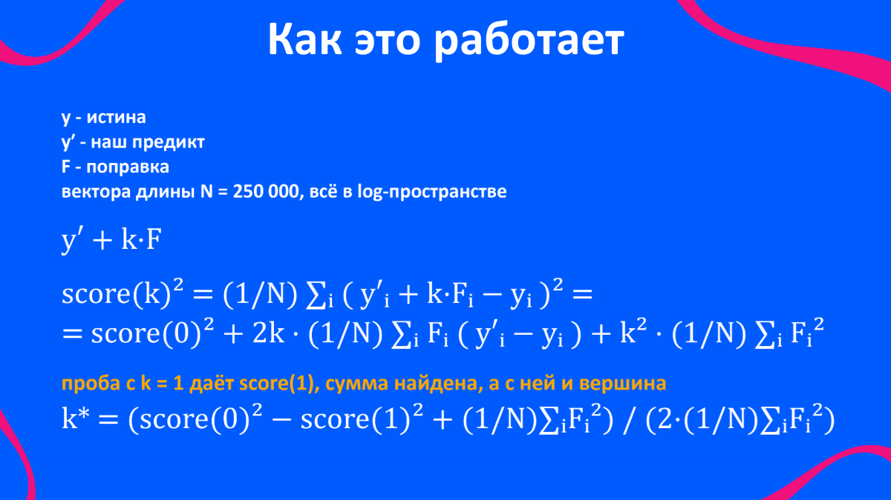

### 13. Система уравнений

41 отправленная проба превращается в систему уравнений на 33 коэффициента. Её решение это
оптимальная комбинация поправок и точный прогноз скора ещё до отправки.

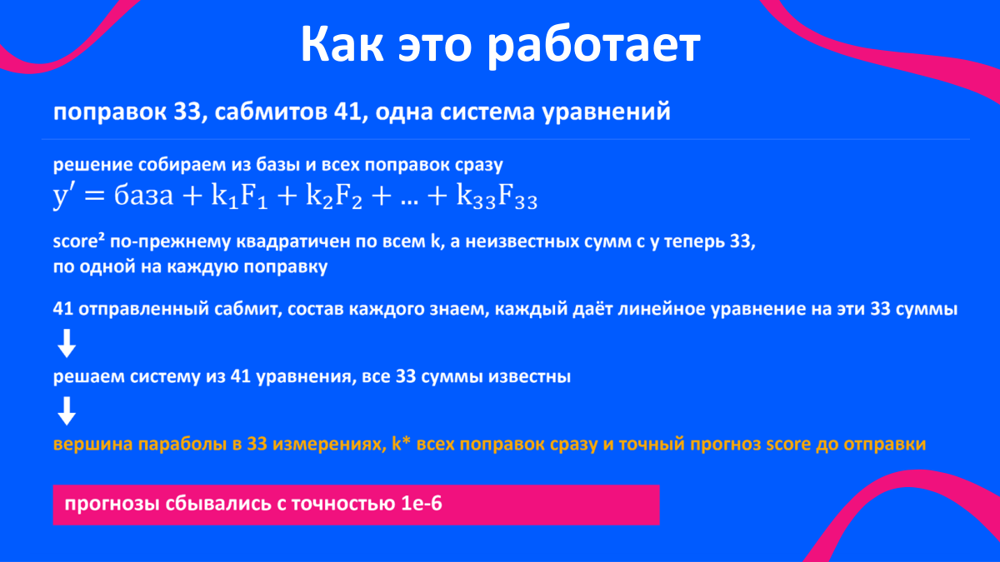

### 14. Борьба с шумом

Главные поправки перестроены на бэгах из 20 сидов и перемерены заново, иначе половина
вектора-поправки состоит из случайности конкретного обучения.

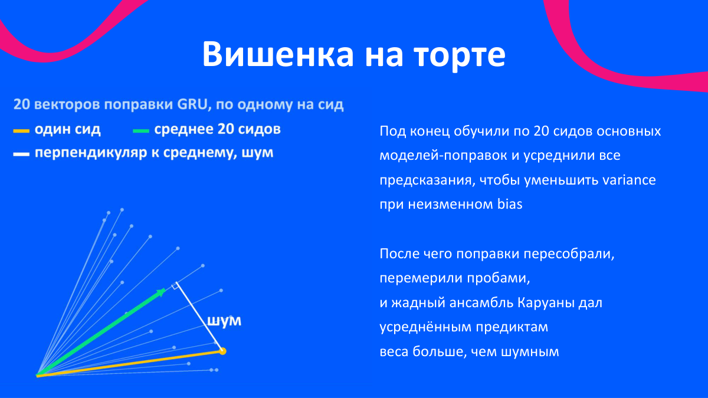

### 15. Результат

Приватный лидерборд подтвердил, что это не подгонка под публичную выборку: наш сдвиг
на привате по сравнению с пабликом составил +0.0158 и оказался наименьшим среди команд из топа лидерборда.


### 16. Как формировались финальные сабмиты

Как формировали итоговые решения (полное решение и усадка коэффициентов по Джеймсу-Стейну).

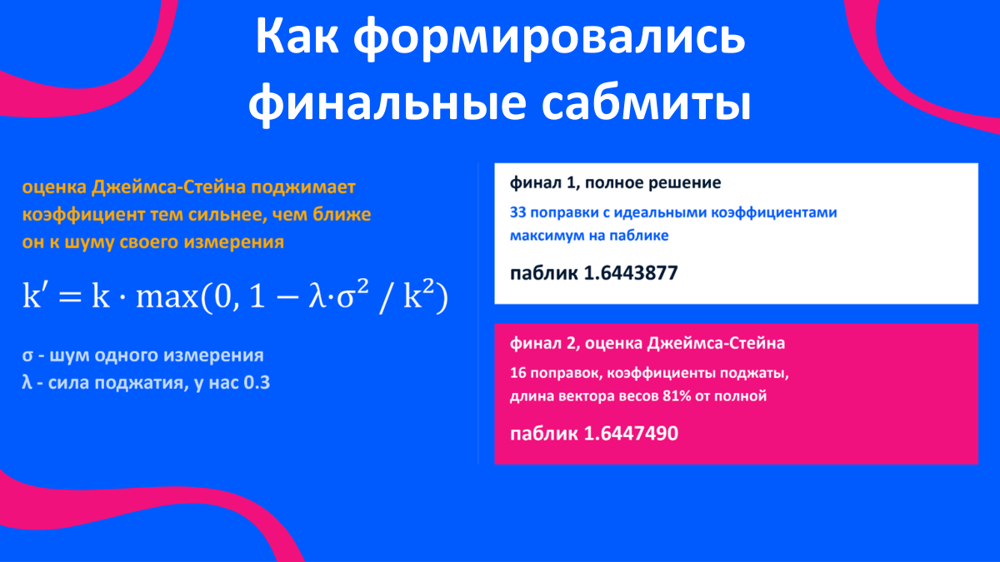

---

## Как воспроизвести

Нужны GPU и данные организаторов. На одной RTX 5090 запуск занимает порядка суток–полутора:

```bash
pip install -r requirements.txt
cp /путь/к/train.parquet data/
python scripts/run_all.py --gpus 0          # несколько карт: --gpus 0,1,2
```

На выходе `output/sub_v41_L233.csv` и `output/sub_v41shrink_L233.csv`. Скрипт сам сверяет их с копиями реально отправленных файлов (они лежат в `artifacts/submissions/`).

Прогон устроен как цепочка стадий, каждая пропускает уже посчитанное, поэтому его можно
прерывать и продолжать. `python scripts/run_all.py --check` показывает, что готово;
`--stage <имя>` запускает одну стадию.

| стадия | действия | ресурс |
|---|---|---|
| `features` | считает по 272 агрегатных признака на пользователя для набора учебных дат | CPU |
| `gbm` | обучает 15 моделей градиентного бустинга | CPU |
| `train` | обучает 144 нейросети; точные команды с гиперпараметрами и сидами — `pipeline/jobs.json` | GPU |
| `predict` | строит 119 предсказаний тестового периода этими моделями | GPU |
| `blend` | усредняет 13 лучших моделей с подобранными весами — получается «базовый» сабмит | CPU |
| `forms` | строит 34 вектора-поправки к базе | CPU |
| `finals` | подбирает коэффициенты поправок по записям лидерборда и собирает оба финальных CSV | CPU, секунды |

Есть два режима точности воспроизведения нашего решения:

* **из записанных поправок** (`python scripts/reproduce_finals.py`, секунды, без данных и GPU) - финальные файлы совпадают с отправленными (расхождение ~10⁻⁸ от округления);
* **полный прогон от данных** - все модели и большинство поправок пересобираются заново; итог   совпадает с отправленными с точностью ~3·10⁻⁴ (rms в log-пространстве). Точнее нельзя принципиально, т.к. шаг вычитания уже измеренного численно чувствителен (базис почти вырожден), а несколько поправок содержат обучение внутри. Влияние на скор ~10⁻⁵ — на два порядка меньше отрыва от второго места (0.00135).

### Требования

* GPU с 32 ГБ видеопамяти, обучающий тензор (15 ГБ) целиком лежит на карте. На 24 ГБ тоже
  работает, но медленнее: тензор остаётся в обычной памяти, скрипт переключает режим сам.
* 64 ГБ RAM, ~20 ГБ диска.
* Python 3.11, torch ≥ 2.5 (для RTX 5090 сборка с CUDA 12.8); точные версии в `docs/env_server.txt`.

Один вход у последней стадии особый: 41 число с публичного лидерборда, скоры сабмитов,
которые мы отправляли по ходу соревнования. Пересчитать их локально нельзя (их выдаёт только лидерборд), поэтому они записаны в код (`tools_lb/solve.py`) как данные. Всё остальное вычисляется из `train.parquet`.